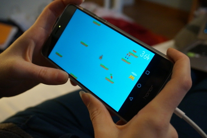

# Carrot Hunter

This is an Android 2D game project for CS7059 at Trinity College (Dublin).   
Goals: agile development, dashing sprites and fun!

### Requirements

 * Android Studio
 * LibGDX
 * Box2D